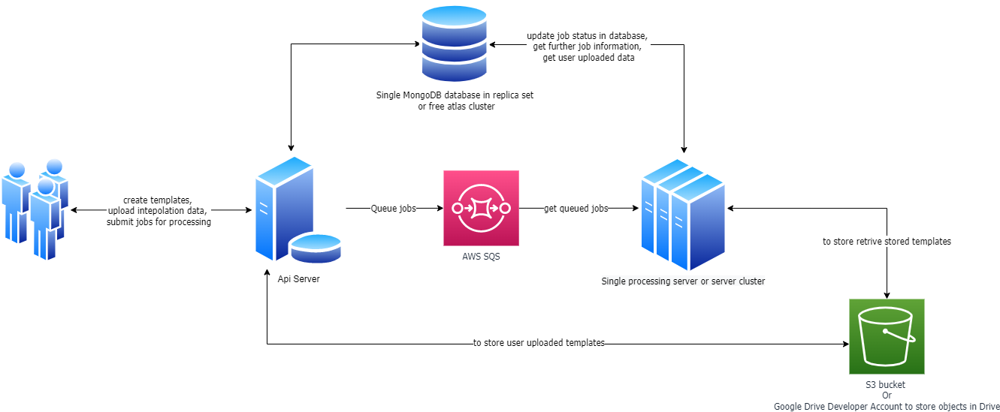

# Paperless Clone - Job Service

A NestJS-based microservice that processes template and dataset combinations to generate personalized greeting cards and documents. This service is part of a larger paperless clone system that allows users to create customized images with interpolated data.

## System Architecture

The paperless clone system consists of two main services:

1. **API Service**: Handles user authentication, template and dataset management, and job submission.
2. **Job Service** (this repository): Processes submitted jobs to generate personalized images by combining templates with user data.

The system is designed to be deployed on Heroku with the following architecture:



## Features

- **AWS SQS Integration**: Consumes jobs from SQS queue submitted by the API service
- **Image Processing**: Uses Fabric.js to manipulate images and add text/graphic elements
- **Dataset Integration**: Merges uploaded templates with dataset values
- **Job Status Tracking**: Maintains changelog of job progress and status
- **Google Drive Integration**: Uploads generated files to Google Drive for storage and sharing
- **Batch Processing**: Generates multiple images based on dataset rows

## Tech Stack

- **Framework**: [NestJS](https://nestjs.com/)
- **Database**: MongoDB (with two separate connections: paperless-db and datasets-db)
- **Message Queue**: AWS SQS for job queue consumption
- **Image Processing**: Fabric.js for canvas manipulation
- **File Storage**: Google Drive API for storing generated files
- **File Archiving**: Archiver for creating zip files of generated images

## Prerequisites

- Node.js (v14 or later)
- MongoDB instance
- AWS account with SQS configured
- Google service account with Drive API access
- Fabric.js dependencies (Cairo, Pango, etc.)

## Installation

1. Clone the repository
   ```bash
   git clone https://github.com/yourusername/paperless-clone-job-service.git
   ```

2. Install dependencies
   ```bash
   npm install
   ```

3. Create environment file
   Create a file named `paperless-job-microservice.env` in the root directory with the following variables:

   ```
   # MongoDB Configuration
   MONGODB_URI=mongodb://localhost:27017/paperless-db
   MONGODB_URI_DATASETS=mongodb://localhost:27017/datasets-db
   
   # AWS Configuration
   AWS_REGION=your-aws-region
   AWS_ACCESS_KEY_ID=your-aws-access-key
   AWS_SECRET_ACCESS_KEY=your-aws-secret-key
   AWS_SQS_QUEUE_URL=your-sqs-queue-url
   AWS_SQS_POLL_CRON_EXPRESSION=*/1 * * * *
   AWS_SQS_POLL_TIMEZONE=America/New_York
   
   # Google Drive Configuration
   GOOGLE_SERVICE_ACCOUNT_JSON={"type":"service_account","project_id":"your-project-id","private_key_id":"your-key-id","private_key":"your-private-key","client_email":"your-service-account-email","client_id":"your-client-id"}
   GDRIVE_OUTPUT_FOLDER_ID=your-folder-id
   ```

## Running the Application

```bash
# Development
npm run start

# Watch mode
npm run start:dev

# Production mode
npm run start:prod
```

## Docker Deployment

The application includes a Dockerfile for containerization:

```bash
# Build the Docker image
docker build -t paperless-clone-job-service .

# Run the container
docker run paperless-clone-job-service
```

## Project Structure

- `src/custom-transports`: AWS SQS consumer implementation
- `src/google`: Google Drive API integration
- `src/jobs`: Core job processing logic
  - `image-processor.service.ts`: Fabric.js canvas manipulation
  - `jobs.service.ts`: Main job processing workflow
  - `archive-helper.service.ts`: File archiving utilities

## Job Processing Flow

1. The application polls the AWS SQS queue for new jobs using a cron job
2. When a job is received, the service retrieves the template and dataset from MongoDB
3. Image processing begins with Fabric.js:
   - The template image is loaded onto a canvas
   - Static elements (text/images) are added to the canvas
   - For each row in the dataset, dynamic elements are added
   - Each variation is saved as a separate image
4. All generated images are archived into a ZIP file
5. The ZIP file is uploaded to Google Drive using the service account
6. The job record is updated with the output file link
7. Job status updates are recorded in the changelog collection

## Testing

```bash
# Unit tests
npm run test

# E2E tests
npm run test:e2e

# Test coverage
npm run test:cov
```

## Integration with API Service

The job service processes jobs submitted by the API service through AWS SQS. The workflow is as follows:

1. API service receives job request from user
2. API service creates a job record in MongoDB
3. API service sends job ID to AWS SQS queue
4. Job service polls SQS queue and processes the job
5. Job service updates the job status in MongoDB
6. API service provides job status and results to user
